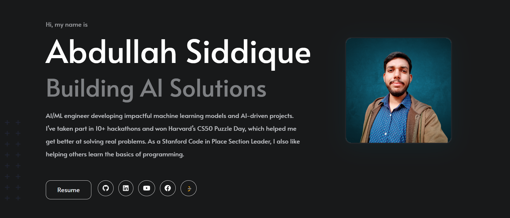

# Abdullah Siddique - Portfolio Website

[](https://abdullah-siddique-dev.netlify.app/)
[](https://linkedin.com/in/mr-abdullah-siddique)
[](https://github.com/abdullah90907)



A modern, responsive portfolio website built with Hugo and the hugo-profile theme. This portfolio showcases my projects, achievements, blog posts, and professional journey in AI/ML, web development, and software engineering.

🌟 **[View Live Website →](https://abdullah-siddique-dev.netlify.app/)**

## 🌟 Features

### 🎨 **Modern Design**
- Clean, professional layout with smooth animations
- Responsive design that works perfectly on all devices
- Dark/Light theme toggle with dynamic logo switching
- Custom CSS optimizations for enhanced user experience

### 📱 **Mobile-First Responsive Design**
- Optimized carousel sections for mobile devices
- Touch-friendly navigation and interactions
- Properly sized components between navigation icons
- Enhanced modal views for achievements and projects

### 🔧 **Dynamic Content Sections**
- **Hero Section**: Professional introduction with animated elements
- **About**: Detailed background and skills showcase
- **Experience**: Professional journey timeline
- **Education**: Academic achievements and certifications
- **Projects**: Interactive project showcase with filtering
- **Achievements**: Carousel-based achievement gallery with modal views
- **Contact**: Multiple contact methods including LinkedIn integration

### 🚀 **Advanced Features**
- SEO optimized with proper meta tags and structured data
- Fast loading with optimized assets and images
- Blog integration with markdown support
- Project showcase with detailed descriptions
- Achievement gallery with certificate viewing
- Contact form integration
- Social media links
- Netlify deployment ready

## 🛠️ Tech Stack

- **Static Site Generator**: [Hugo](https://gohugo.io/)
- **Theme**: [hugo-profile](https://github.com/gurusabarish/hugo-profile)
- **Styling**: Custom CSS with Bootstrap integration
- **Deployment**: Netlify
- **Content Management**: Markdown files
- **Icons**: Font Awesome 6
- **Animations**: CSS animations and transitions

## 📁 Project Structure

```
my-site/
├── archetypes/          # Content templates
├── assets/              # Processed assets
├── content/             # Content files
│   ├── blogs/          # Blog posts
│   └── projects/       # Project pages
├── data/               # Data files
├── layouts/            # Custom templates
│   ├── _default/       # Default templates
│   ├── partials/       # Partial templates
│   │   ├── sections/   # Section components
│   │   └── head/       # Head components
│   └── shortcodes/     # Custom shortcodes
├── static/             # Static assets
│   └── images/         # Images and media
│       ├── *-page.png  # Page screenshots
│       └── ...         # Other images
├── themes/             # Hugo themes
├── hugo.yaml          # Main configuration
├── netlify.toml       # Netlify configuration
└── README.md          # This file
```

## 🚀 Quick Start

### Prerequisites
- [Hugo Extended](https://gohugo.io/getting-started/installing/) (v0.100.0+)
- [Git](https://git-scm.com/)

### Installation

1. **Clone the repository**
   ```bash
   git clone https://github.com/abdullah90907/Portfolio-Website.git
   cd Portfolio-Website
   ```

2. **Initialize Hugo modules** (if using modules)
   ```bash
   hugo mod init github.com/abdullah90907/Portfolio-Website
   ```

3. **Install dependencies**
   ```bash
   hugo mod get
   ```

4. **Start the development server**
   ```bash
   hugo server -D
   ```

5. **Open your browser**
   Navigate to `http://localhost:1313`

## ⚙️ Configuration

### Main Configuration (`hugo.yaml`)

The site is configured through `hugo.yaml`. Key sections include:

- **Basic Settings**: Site title, URL, language
- **Menus**: Navigation menu items
- **Params**: Theme customization and content

### Content Management

#### Adding Blog Posts
Create new blog posts in `content/blogs/`:
```bash
hugo new blogs/my-new-post.md
```

#### Adding Projects
Create new projects in `content/projects/`:
```bash
hugo new projects/my-new-project.md
```

#### Updating Achievements
Edit the achievements section in `hugo.yaml`:
```yaml
params:
  achievements:
    enable: true
    title: "Achievements"
    items:
      - title: "Achievement Title"
        content: "Description"
        image: "/images/achievement.png"
        url: "https://certificate-url.com"
```

### Customization

#### Theme Toggle
The site supports dynamic logo switching based on theme:
```yaml
params:
  navbar:
    brandLogoLight: "/images/logo.png"      # Light theme logo
    brandLogoDark: "/images/logo-white.png"  # Dark theme logo
    brandNameLight: "Abdullah"               # Light theme text
    brandNameDark: "Abdullah"                # Dark theme text
```

#### Contact Section
Configure contact methods:
```yaml
params:
  contact:
    enable: true
    linkedin:
      enable: true
      profileId: "mr-abdullah-siddique"
```

## 📸 Screenshots

### Home Page


### Projects Section  


### Achievements Section


## 🎨 Customization Guide

### Adding Custom Styles
Create custom CSS in `assets/css/` or add inline styles in layouts.

### Modifying Layouts
Edit files in `layouts/` to customize the site structure:
- `layouts/_default/baseof.html` - Base template
- `layouts/partials/sections/` - Individual sections
- `layouts/partials/head.html` - Head section

### Adding New Sections
1. Create a new partial in `layouts/partials/sections/`
2. Include it in the main layout
3. Add configuration in `hugo.yaml`

## 🚀 Deployment

### Netlify Deployment

1. **Push to GitHub**
   ```bash
   git add .
   git commit -m "Initial commit"
   git push origin main
   ```

2. **Connect to Netlify**
   - Link your GitHub repository to Netlify
   - Set build command: `hugo --minify`
   - Set publish directory: `public`

3. **Environment Variables** (if needed)
   ```
   HUGO_VERSION=0.120.4
   HUGO_ENV=production
   ```

### Manual Deployment
```bash
hugo --minify
# Upload the public/ folder to your hosting provider
```

## 🔧 Development

### Local Development
```bash
# Start development server with drafts
hugo server -D

# Start with specific port
hugo server -p 8080

# Build for production
hugo --minify
```

### Content Guidelines

#### Blog Posts Format
```markdown
---
title: "Post Title"
date: 2025-06-25T12:00:00Z
draft: false
tags: ["tag1", "tag2"]
categories: ["category"]
description: "Post description"
---

Content goes here...
```

#### Project Pages Format
```markdown
---
title: "Project Title"
date: 2025-06-25T12:00:00Z
draft: false
description: "Project description"
image: "/images/project-image.png"
technologies: ["React", "Node.js"]
github: "https://github.com/abdullah90907/Portfolio-Website"
demo: "https://abdullah-siddique-dev.netlify.app/"
---

Project content...
```

## 🤝 Contributing

1. Fork the repository
2. Create a feature branch (`git checkout -b feature/amazing-feature`)
3. Commit your changes (`git commit -m 'Add amazing feature'`)
4. Push to the branch (`git push origin feature/amazing-feature`)
5. Open a Pull Request

## 📝 License

This project is licensed under the MIT License - see the [LICENSE](LICENSE) file for details.

### MIT License Summary
- ✅ **Commercial use** - You can use this code for commercial projects
- ✅ **Modification** - You can modify and adapt the code
- ✅ **Distribution** - You can distribute the original or modified code
- ✅ **Private use** - You can use the code privately
- ⚠️ **License and copyright notice** - Must include the original license and copyright notice
- ❌ **Liability** - The author is not liable for any damages
- ❌ **Warranty** - No warranty is provided


## 📞 Contact

- **Email**: [abdullahsiddique773@gmail.com](mailto:abdullahsiddique773@gmail.com)
- **LinkedIn**: [Abdullah Siddique](https://linkedin.com/in/mr-abdullah-siddique)
- **GitHub**: [abdullah90907](https://github.com/abdullah90907)
- **Website**: [abdullah-siddique-dev.netlify.app](https://abdullah-siddique-dev.netlify.app/)

---

⭐ **If you found this portfolio helpful, please give it a star!** ⭐

## 🔗 Quick Links

- 🌐 **[Live Website](https://abdullah-siddique-dev.netlify.app/)**
- 📱 **[LinkedIn Profile](https://linkedin.com/in/mr-abdullah-siddique)**
- 💻 **[GitHub Repository](https://github.com/abdullah90907/Portfolio-Website)**
- 📧 **[Email Contact](mailto:abdullahsiddique773@gmail.com)**
